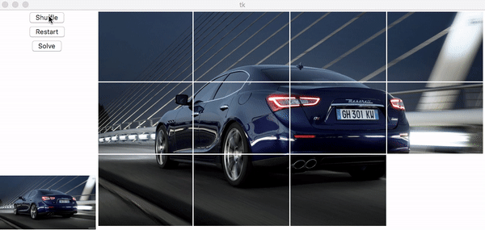

# Sliding_Puzzle
A sliding puzzle game that supports user images and any grid size with a generic solver that us optimal.


## Install
Clone the repository or copy/download all the python files.

## Run
In the directory of these files:
```shell
Pyhton3 puzzle_driver.py image_file_path
```
e.g.
```shell
Pyhton3 puzzle_driver.py images/car.jpg
```
(This generally works for any .jpg or .png images you have.)

Close the GUI and the program will exit.

## Demo


Notice that it took a shorter time, i.e. less moves, to solve the puzzle then the initial shuffling. That is because the solving algorithm is gaurenteed to produce the optimal solution (shortest path).

## In-Game Details
- Use arrow keys to slide the puzzle block.The game will recognize a successful completetion.
- The Shuffle button can be used multiple times to increase difficulty
- The Solve button solves the puzzle and move the blocks automatically
  - For a puzzle larger than 3x3, it can take up to a few minutes to solve. The search space of the puzzle is O((mn)!). For example, a 4x4 would be 16! = 2e13
- The Restart button resumes the puzzle back to the ordered state

## Generic Solver (Solver.py)
A generic(any size: mxn) sliding puzzle solving algorithm/ program
- Independent from the game process
- It does not track previous user or shuffling movements. I.e. The solver starts with no knowledge about the puzzle (how it got here) except its current state/layout.

Solving the puzzle can be seen as a graph search problem
- The "node" is simply the state of the puzzle. e.g. for a 2x2: [[2,0],[3,1]], and the goal state would be [[0,1],[2,3]].
- Every valid "move" represents traversing from a node to another
- This is a rather sparse graph (a node has at most 4 valid moves/ neighbors), but a factorial numbers of nodes.
- Implements breadth first search and the A star algorithm (A*)
- A* is significantly faster as expected (seconds vs. mintues)

## Todo
- [ ] Clean up and remove shell output
